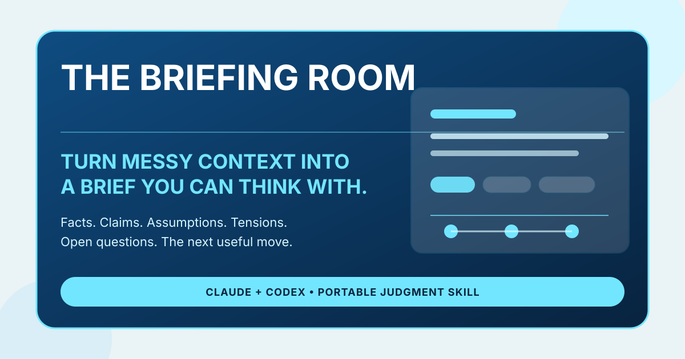
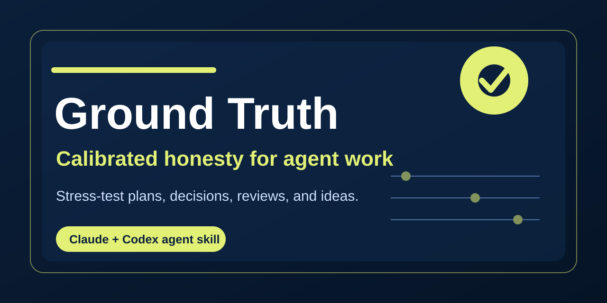
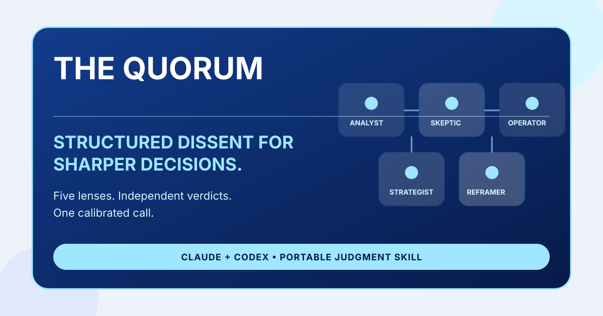

# Judgment Infrastructure for Human-Led AI

Portable agent skills by Greg Lichtenthal for people who want AI to strengthen human creativity, judgment, and agency.

This catalog is built around judgment infrastructure for human-led AI work: organize messy context, pressure-test the thinking, and deliberate consequential decisions.

Read the short thesis: [Judgment Infrastructure for Human-Led AI](https://glichtenthal.github.io/agent-skills/manifesto/)

## Start here

| If you have... | Use... |
| --- | --- |
| Messy notes, transcripts, research, or context | [The Briefing Room](https://github.com/glichtenthal/briefing-room) |
| A claim, plan, draft, or idea that needs honest critique | [Ground Truth](https://github.com/glichtenthal/ground-truth) |
| A consequential decision with real trade-offs | [The Quorum](https://github.com/glichtenthal/the-quorum) |

## Skills

### [The Briefing Room](https://github.com/glichtenthal/briefing-room)

Turn messy context into a brief you can think with.

- Install: https://github.com/glichtenthal/briefing-room/releases/download/v1.0/briefing-room.skill
- Best for: messy notes, transcripts, research dumps, meeting context, customer feedback, and personal sensemaking.

### [Ground Truth](https://github.com/glichtenthal/ground-truth)

Calibrated honesty and anti-sycophancy for plans, decisions, reviews, and ideas.

- Install: https://github.com/glichtenthal/ground-truth/releases/download/v1.0/ground-truth.skill
- Best for: pressure-testing ideas, reviewing work, avoiding easy validation.

### [The Quorum](https://github.com/glichtenthal/the-quorum)

A five-member expert council that pressure-tests consequential decisions.

- Install: https://github.com/glichtenthal/the-quorum/releases/download/v1.0/the-quorum.skill
- Best for: strategy calls, hiring decisions, build-vs-buy choices, and other consequential trade-offs.

## Compatibility

These skills are designed for Claude and Codex-style agent workflows. Each repository includes its own installation instructions and Codex interface metadata.

## How they fit together

- **The Briefing Room** organizes messy context into a structured brief.
- **Ground Truth** pressure-tests the brief, claim, plan, or draft.
- **The Quorum** convenes multiple expert lenses for consequential decisions.
