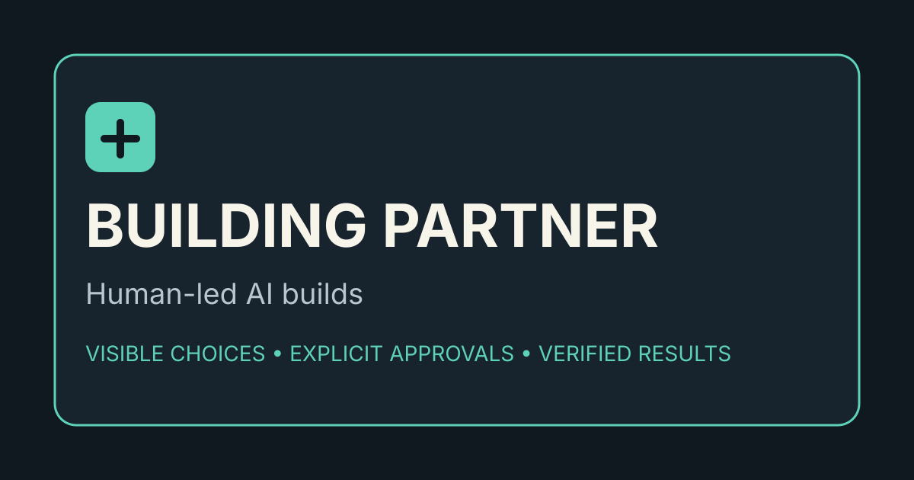

# Judgment Infrastructure for Human-Led AI

Portable agent skills by Greg Lichtenthal for people who want AI to strengthen human creativity, judgment, and agency.

This catalog is built around judgment infrastructure for human-led AI work: organize messy context, pressure-test the thinking, deliberate consequential decisions, and test ideas before trusting them.

Read the short thesis: [Judgment Infrastructure for Human-Led AI](https://glichtenthal.github.io/agent-skills/manifesto/)

Start with the guided workflow: [Start Here](https://glichtenthal.github.io/agent-skills/start-here/)

See the full loop in one scenario: [Judgment Infrastructure Demo](https://glichtenthal.github.io/agent-skills/demo/) ([Markdown source](examples/judgment-infrastructure-demo.md))

Browse practical use cases: [Product Strategy](https://glichtenthal.github.io/agent-skills/use-cases/product-strategy/) · [Founder Decisions](https://glichtenthal.github.io/agent-skills/use-cases/founder-decisions/) · [Research Synthesis](https://glichtenthal.github.io/agent-skills/use-cases/research-synthesis/) · [Career Decisions](https://glichtenthal.github.io/agent-skills/use-cases/career-decisions/)

Awesome list: [awesome-judgment-infrastructure](https://github.com/glichtenthal/awesome-judgment-infrastructure)

## Install the full suite for Codex

The suite installer downloads the pinned stable release of all four skills into Codex's current user-skills directory:

```bash
git clone https://github.com/glichtenthal/agent-skills.git
cd agent-skills
bash install.sh --target codex
```

Use `--dry-run` to preview the installation, `--update` to replace existing copies, or `--skill the-quorum` to install one skill. Building Partner is an optional applied skill, so install it explicitly with `bash install.sh --skill building-partner`. Run `bash install.sh --help` for all options.

For ChatGPT or Claude, import each `.skill` release through the product's Skills settings. The shell installer is for Codex.

## Start here

You do not need the full loop every time. Start with the part that matches what you have.

| If you have... | Use... | Output |
| --- | --- | --- |
| Messy notes, transcripts, research, or context | [The Briefing Room](https://github.com/glichtenthal/briefing-room) | A brief you can think with |
| A claim, plan, draft, or idea that needs honest critique | [Ground Truth](https://github.com/glichtenthal/ground-truth) | Weak assumptions, missing evidence, and sharper next steps |
| A consequential decision with real trade-offs | [The Quorum](https://github.com/glichtenthal/the-quorum) | Structured disagreement and a calibrated recommendation |
| An idea, claim, or decision that needs proof before commitment | [Test Drive](https://github.com/glichtenthal/test-drive) | The smallest credible test and the signal that would change your mind |

## Skills

### [The Briefing Room](https://github.com/glichtenthal/briefing-room)


Turn messy context into a brief you can think with.

- Install: https://github.com/glichtenthal/briefing-room/releases/download/v1.2.1/briefing-room.skill
- Best for: messy notes, transcripts, research dumps, meeting context, customer feedback, and personal sensemaking.
- Quick demo: https://github.com/glichtenthal/briefing-room/blob/main/examples/quick-demo.md

### [Ground Truth](https://github.com/glichtenthal/ground-truth)


Calibrated honesty and anti-sycophancy for plans, decisions, reviews, and ideas.

- Install: https://github.com/glichtenthal/ground-truth/releases/download/v1.2/ground-truth.skill
- Best for: pressure-testing ideas, reviewing work, avoiding easy validation.
- Quick demo: https://github.com/glichtenthal/ground-truth/blob/main/examples/quick-demo.md

### [The Quorum](https://github.com/glichtenthal/the-quorum)


A five-member expert council that pressure-tests consequential decisions.

- Install: https://github.com/glichtenthal/the-quorum/releases/download/v1.4.1/the-quorum.skill
- Best for: strategy calls, hiring decisions, build-vs-buy choices, and other consequential trade-offs.
- Quick demo: https://github.com/glichtenthal/the-quorum/blob/main/examples/quick-demo.md

### [Test Drive](https://github.com/glichtenthal/test-drive)


Test an idea before you trust it.

- Install: https://github.com/glichtenthal/test-drive/releases/download/v1.6.1/test-drive.skill
- Best for: testing ideas, messages, prompts, skills, strategies, decisions, and data claims before overcommitting.
- Quick demo: https://github.com/glichtenthal/test-drive/blob/main/examples/quick-demo.md

## Compatibility

These skills are designed for Claude and Codex-style agent workflows. Each repository includes its own installation instructions and Codex interface metadata.

## How they fit together

- **The Briefing Room** organizes messy context into a structured brief.
- **Ground Truth** pressure-tests the brief, claim, plan, or draft.
- **The Quorum** convenes multiple expert lenses for consequential decisions.
- **Test Drive** turns ideas, claims, and decisions into small evidence-seeking trials.

**Ready to build?** [Building Partner](https://github.com/glichtenthal/building-partner) carries the work into implementation.

## Applied Judgment Systems

Applied Judgment Systems carry human-led judgment into a particular domain or stage of work. Some are portable skills, while others are complete applications.

### [Building Partner](https://github.com/glichtenthal/building-partner)



A portable operating skill for planning and building apps, prototypes, automations, integrations, and other technical workflows.

Use it independently whenever AI is helping you build something. It can also follow the judgment loop, carrying clarified context, tested assumptions, and accepted decisions into implementation with visible trade-offs, explicit approvals, and verification against the real use case.

- Install: https://github.com/glichtenthal/building-partner/releases/download/v1.0.0/building-partner.skill
- Best for: human-led AI builds where data, cost, security, portability, deployment, or maintenance choices matter.
- Quick demo: https://github.com/glichtenthal/building-partner/blob/main/examples/quick-demo.md

### [Media, Tech & AI Executive Recruiter GPT](https://chatgpt.com/g/g-69c612c858188191a9d6d98fddd5b5b6-media-tech-ai-executive-recruiter)

A domain-specific application of the same judgment-first principles for recruiter-style coaching across media, technology, ad-tech, and AI business-side roles.
