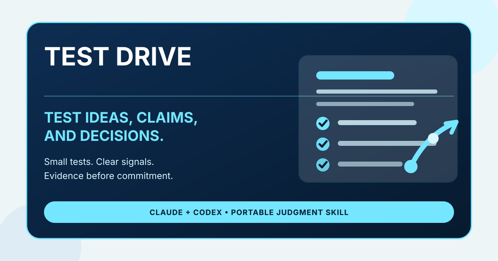

# Judgment Infrastructure for Human-Led AI

Portable agent skills by Greg Lichtenthal for people who want AI to strengthen human creativity, judgment, and agency.

This catalog is built around judgment infrastructure for human-led AI work: organize messy context, pressure-test the thinking, deliberate consequential decisions, and test ideas before trusting them.

Read the short thesis: [Judgment Infrastructure for Human-Led AI](https://glichtenthal.github.io/agent-skills/manifesto/)

Start with the guided workflow: [Start Here](https://glichtenthal.github.io/agent-skills/start-here/)

See the full loop in one scenario: [Judgment Infrastructure Demo](https://glichtenthal.github.io/agent-skills/demo/) ([Markdown source](examples/judgment-infrastructure-demo.md))

Browse practical use cases: [Product Strategy](https://glichtenthal.github.io/agent-skills/use-cases/product-strategy/) · [Founder Decisions](https://glichtenthal.github.io/agent-skills/use-cases/founder-decisions/) · [Research Synthesis](https://glichtenthal.github.io/agent-skills/use-cases/research-synthesis/) · [Career Decisions](https://glichtenthal.github.io/agent-skills/use-cases/career-decisions/)

Awesome list: [awesome-judgment-infrastructure](https://github.com/glichtenthal/awesome-judgment-infrastructure)

## Start here

| If you have... | Use... |
| --- | --- |
| Messy notes, transcripts, research, or context | [The Briefing Room](https://github.com/glichtenthal/briefing-room) |
| A claim, plan, draft, or idea that needs honest critique | [Ground Truth](https://github.com/glichtenthal/ground-truth) |
| A consequential decision with real trade-offs | [The Quorum](https://github.com/glichtenthal/the-quorum) |
| An idea, claim, or decision that needs a small test before commitment | [Test Drive](https://github.com/glichtenthal/test-drive) |

## Skills

### [The Briefing Room](https://github.com/glichtenthal/briefing-room)

Turn messy context into a brief you can think with.

- Install: https://github.com/glichtenthal/briefing-room/releases/download/v1.1/briefing-room.skill
- Best for: messy notes, transcripts, research dumps, meeting context, customer feedback, and personal sensemaking.
- Quick demo: https://github.com/glichtenthal/briefing-room/blob/main/examples/quick-demo.md

### [Ground Truth](https://github.com/glichtenthal/ground-truth)

Calibrated honesty and anti-sycophancy for plans, decisions, reviews, and ideas.

- Install: https://github.com/glichtenthal/ground-truth/releases/download/v1.1/ground-truth.skill
- Best for: pressure-testing ideas, reviewing work, avoiding easy validation.
- Quick demo: https://github.com/glichtenthal/ground-truth/blob/main/examples/quick-demo.md

### [The Quorum](https://github.com/glichtenthal/the-quorum)

A five-member expert council that pressure-tests consequential decisions.

- Install: https://github.com/glichtenthal/the-quorum/releases/download/v1.1/the-quorum.skill
- Best for: strategy calls, hiring decisions, build-vs-buy choices, and other consequential trade-offs.
- Quick demo: https://github.com/glichtenthal/the-quorum/blob/main/examples/quick-demo.md

### [Test Drive](https://github.com/glichtenthal/test-drive)

Test an idea before you trust it.

- Install: https://github.com/glichtenthal/test-drive/releases/download/v1.4/test-drive.skill
- Best for: testing ideas, messages, prompts, skills, strategies, decisions, and data claims before overcommitting.
- Quick demo: https://github.com/glichtenthal/test-drive/blob/main/examples/quick-demo.md

## Compatibility

These skills are designed for Claude and Codex-style agent workflows. Each repository includes its own installation instructions and Codex interface metadata.

## How they fit together

- **The Briefing Room** organizes messy context into a structured brief.
- **Ground Truth** pressure-tests the brief, claim, plan, or draft.
- **The Quorum** convenes multiple expert lenses for consequential decisions.
- **Test Drive** turns ideas, claims, and decisions into small evidence-seeking trials.
